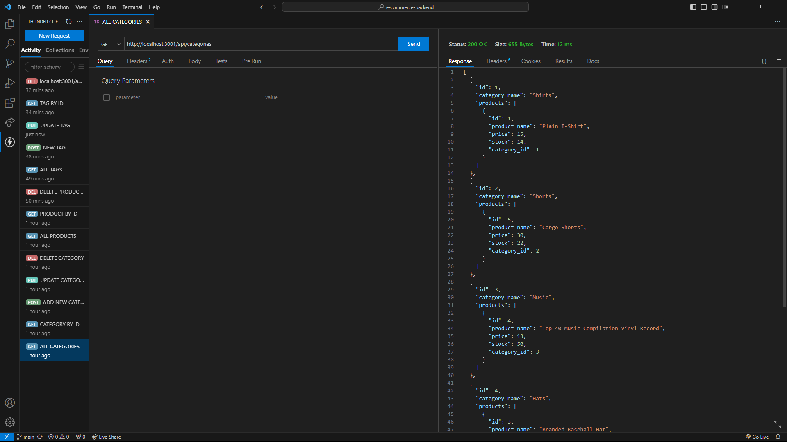

# E-Commerce Backend


## Description

The purpose of the this project primarily focuses on learning how to use Sequelize and create a backend server/database for a potential e-commerce website. The motivation for this project was to enhance back-end programming and solidify an understanding of Sequelize, MySQL, and Express. This project was built to create a backend program that manages the server-side data of an e-commerce website. The problem this solves is creating an effective that allows e-commerce websites to manage their products, and tags. 

## Installation

To install this project, users should run the following command inside the integrated terminal:
````
npm i
````

## Usage 

As this is a backend program, all functionality will be running through VSCode and Thunderclient (also works with Insomnia). Users should first access the database by opening an integrated terminal and entering MySQL via command "mysql -u root" and running the database with command "SOURCE ./schema.sql;". Once the database has been accessed, users will open another integrated terminal and run command "npm run seed" to seed the database with premade data. Command "npm start" will now run the application on a localhost server with specified port number 3001. From there, users may use Thunderclient or Insomnia to interact with the server by sending GET, POST, PUT, and DELETE requests.

## Credits 

Sequelize, MySQL, and Express for programs used within the created application. Thunderclient and Insomnia for the interface used to test the functionality of the code when interacting with the routes in the created API. 

## Links(s)

https://github.com/chriswaje/e-commerce-backend (link to project repository)

https://drive.google.com/file/d/1GSnJ6lo6fnA6gnLOkNgBYfzSaBLRldvd/view?usp=sharing (link to demonstration video)

## Image(s)

